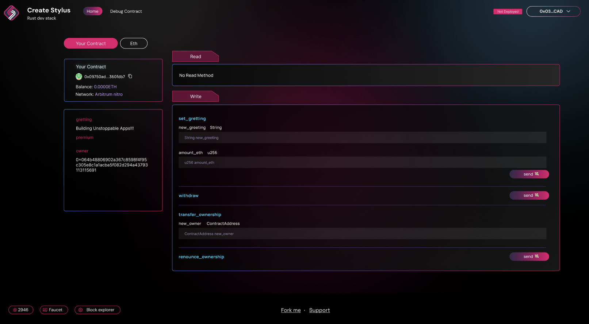

# 🏗 scaffold-stylus

<h4 align="center">
  <a href="https://arb-stylus.github.io/scaffold-stylus-docs/">Documentation</a> |
  <a href="https://www.scaffoldstylus.com/">Website</a>
</h4>

🧪 An open-source, up-to-date toolkit for building decentralized applications (dapps) on the Arbitrum blockchain. It's designed to make it easier for developers to create and deploy smart contracts and build user interfaces that interact with those contracts.

⚙️ Built using Rust, NextJS, RainbowKit, Stylus, Wagmi, Viem, and TypeScript.

- ✅ **Contract Hot Reload**: Your frontend auto-adapts to your smart contract as you edit it.
- 🪝 **[Custom hooks](https://arb-stylus.github.io/scaffold-stylus-docs/components)**: Collection of React hooks wrapped around [wagmi](https://wagmi.sh/) to simplify interactions with smart contracts with TypeScript autocompletion.
- 🧱 [**Components**](https://arb-stylus.github.io/scaffold-stylus-docs/hooks): Collection of common web3 components to quickly build your frontend.
- 🔥 **Burner Wallet & Local Faucet**: Quickly test your application with a burner wallet and local faucet.
- 🔐 **Integration with Wallet Providers**: Connect to different wallet providers and interact with the Arbitrum network.



## Requirements

Before you begin, you need to install the following tools:

- [Node (>= v20.18)](https://nodejs.org/en/download/)
- Yarn ([v2+](https://yarnpkg.com/getting-started/install))
- [Git](https://git-scm.com/downloads)
- [Rust](https://www.rust-lang.org/tools/install)
- [Docker](https://docs.docker.com/engine/install/)
- [Foundry Cast](https://getfoundry.sh/)

## Quickstart

To get started with Scaffold-Stylus, follow the steps below:

### 1. Clone this repo & install dependencies

```bash
git clone https://github.com/Arb-Stylus/scaffold-stylus.git
cd scaffold-stylus
yarn install
# Initialize submodules (required for Nitro dev node)
git submodule update --init --recursive
```

### 2. Install Stylus tools

Install [Rust](https://www.rust-lang.org/tools/install), and then install the Stylus CLI tool with Cargo:

```bash
cargo install --force cargo-stylus cargo-stylus-check
```

**Prerequisite:**

- `cargo-stylus` version `^0.6.1`
- `rustc` version match with `packages/stylus/your-contract/rust-toolchain.toml`

Set default `toolchain` match `rust-toolchain.toml` and add the `wasm32-unknown-unknown` build target to your Rust compiler:

```bash
rustup default 1.87
rustup target add wasm32-unknown-unknown --toolchain 1.87
```

You should now have it available as a Cargo subcommand:

```bash
cargo stylus --help
```

### 3. Run a local network

In your first terminal:

```bash
yarn chain
```

This command starts a local Stylus-compatible network using the Nitro dev node script (`./nitro-devnode/run-dev-node.sh`). The network runs on your local machine and can be used for testing and development. You can customize the Nitro dev node configuration in the `nitro-devnode` submodule.

### 4. Deploy the test contract

In your second terminal:

```bash
yarn deploy
```

This command deploys a test smart contract to the local network. The contract is located in `packages/stylus/your-contract/src` and can be modified to suit your needs. The `yarn deploy` command uses the deploy script located in `packages/stylus/scripts` to deploy the contract to the network. You can also customize the deploy script .

### 5. Start your NextJS app

In your third terminal:

```bash
yarn start
```

Visit your app at: `http://localhost:3000`. You can interact with your smart contract using the **Debug Contracts** page, which provides a user-friendly interface for testing your contract's functions and viewing its state.

### 6. Test your smart contract

```bash
yarn stylus:test
```

## Development Workflow

- Edit your smart contract `lib.rs` in `packages/stylus/your-contract/src`
- Edit your frontend in `packages/nextjs/app`
- Edit your deployment scripts in `packages/stylus/scripts`

## Create Your Own Contract

Scaffold-Stylus enables you to create and deploy multiple contracts within a single project. Follow the steps below to create and deploy your own contracts.

### Step 1: Generate New Contract

Use the following command to create a new contract and customize it as needed:

```bash
yarn new-module <contract-name>
```

The generated contract will be located in `packages/stylus/<contract-name>`.

### Step 2: Deploy Your Contract

```bash
yarn deploy [...options]
```

This command runs the `deploy.ts` script located in `packages/stylus/scripts`. You can customize this script with your deployment logic.

**Available Options:**

- `--network <network>`: Specify which network to deploy to
- `--estimate-gas`: Only perform gas estimation without deploying
- `--max-fee=<maxFee>`: Set maximum fee per gas in gwei

**Note:** Deployment information is automatically saved in `packages/stylus/deployments` by default.

## Deploying to Other Networks

To deploy your contracts to other networks (other than the default local Nitro dev node), you'll need to configure your RPC endpoint and wallet credentials.

### Prerequisites

1. **Set the RPC URL**

   Configure your target network's RPC endpoint using the proper `RPC_URL_<network>` environment variable. You can set this in your shell or create a `.env` file (see `.env.example` for reference):

   ```env
   RPC_URL_SEPOLIA=https://your-network-rpc-url
   ```

   **Note:** If RPC URL is not provided, system will use default public RPC URL from that network

2. **Set the Private Key**

   For real deployments, you must provide your own wallet's private key. Set the `PRIVATE_KEY_<network>` environment variable:

   ```env
   PRIVATE_KEY_SEPOLIA=your_private_key_here
   ```

   **Security Note:** A development key is used by default when running the Nitro dev node locally, but for external deployments, you must provide your own private key.

3. **Set the Account Address**

   Set the `ACCOUNT_ADDRESS_<network>`

   ```env
   ACCOUNT_ADDRESS_SEPOLIA=your_account_address_here
   ```

4. **Update Frontend Configuration**

   Open `packages/nextjs/scaffold.config.ts` and update the `targetNetworks` array to include your target chain. This ensures your frontend connects to the correct network and generates the proper ABI in `deployedContracts.ts`:

   ```ts
   import * as chains from "viem/chains";
   // ...
   targetNetworks: [chains.arbitrumSepolia],
   ```

### Available Networks

This template supports Arbitrum networks only. You can test which networks are available and their RPC URLs:

```bash
yarn info:networks
```

This will show you all supported networks and their corresponding RPC endpoints.

### Deploy to Other Network

Once configured, deploy to your target network:

```bash
yarn deploy --network <network>
```

**Important Security Notes:**

- The values in `.env.example` provide a template for required environment variables
- **Always keep your private key secure and never commit it to version control**
- Consider using environment variable management tools for production deployments

## Verify your contract (Highly Experimental)

<details>

#### Prerequisites

Your contract must meet Arbiscan's verification requirements:

- No external libraries
- No constructor arguments
- No custom optimization settings
- No specific compiler version requirements

Check full documentation for more [details](https://docs.arbitrum.io/stylus/how-tos/verifying-contracts-arbiscan#step-4-set-evm-version)

### Stylus Local Verification (Under Development)

Make sure your constructor does not contain any args

```rs
pub fn constructor(&mut self)
```

The scaffold includes built-in local verification to ensure your Stylus contract deployments are reproducible. To enable verification during deployment, set `verify: true` in your deployment script:

```ts
await deployStylusContract({
  contract: "your-contract",
  verify: true,
  ...deployOptions,
});
```

This runs `cargo stylus verify` locally after deployment, which:

- Verifies that the deployed bytecode matches your source code
- Ensures reproducibility across different environments
- Validates the deployment transaction

**Note:** This feature is still under development and may not work as expected. Check full documentation for more [details](https://docs.arbitrum.io/stylus/how-tos/verifying-contracts)

### Arbiscan Verification

For public verification on Arbiscan, follow these steps:

#### Steps

1. **Create a dedicated repository** containing only your contract source code
2. **Navigate to Arbiscan**:
   - Go to [Arbiscan Verify Contract](https://arbiscan.io/verifyContract)
   - Enter your deployed contract address
3. **Follow the verification process**:
   - Select "Solidity (Standard-Json-Input)" as the compiler type
   - Enter your contract source code (github link)
   - Provide any constructor arguments if applicable
   - Submit for verification

Check official document for detail instructions: <https://docs.arbitrum.io/stylus/how-tos/verifying-contracts-arbiscan>

> **Note**: Arbiscan verification for Stylus contracts is still evolving. If you encounter issues, consider using the local verification method or check Arbiscan's latest documentation for Stylus-specific instructions.

</details>

## 🛠️ Troubleshooting Common Issues

#### 1. `stylus` Not Recognized

If you encounter an error stating that `stylus` is not recognized as an external or internal command, run the following command in your terminal:

```bash
sudo apt-get update && sudo apt-get install -y pkg-config libssl-dev
```

After that, check if `stylus` is installed by running:

```bash
cargo stylus --version
```

If the version is displayed, `stylus` has been successfully installed and the path is correctly set.

#### 2. ABI Not Generated

If you face issues with the ABI not being generated, you can try one of the following solutions:

- **Restart Docker Node**: Pause and restart the Docker node and the local setup of the project. You can do this by deleting all ongoing running containers and then restarting the local terminal using:

  ```bash
  yarn run dev
  ```

- **Modify the Script**: In the `run-dev-node.sh` script, replace the line:

  ```bash
  cargo stylus export-abi
  ```

  with:

  ```bash
  cargo run --manifest-path=Cargo.toml --features export-abi
  ```

- **Access Denied Issue**: If you encounter an access denied permission error during ABI generation, run the following command and then execute the script again:

  ```bash
  sudo chown -R $USER:$USER target
  ```

#### 3. 🚨 Fixing Line Endings and Running Shell Scripts in WSL

> ⚠️ This guide provides step-by-step instructions to resolve the Command not found error caused by CRLF line endings in shell scripts when running in a WSL environment.

Shell scripts created in Windows often have `CRLF` line endings, which cause issues in Unix-like environments such as WSL. To fix this:

**Using `dos2unix`:**

1. Install `dos2unix` (if not already installed):

   ```bash
   sudo apt install dos2unix
   ```

2. Convert the script's line endings:

   ```bash
   dos2unix run-dev-node.sh
   ```

3. Make the Script Executable:

   ```bash
   chmod +x run-dev-node.sh
   ```

4. Run the Script in WSL:

   ```bash
   bash run-dev-node.sh
   ```

---

## Documentation

Visit our [docs](https://arb-stylus.github.io/scaffold-stylus-docs/) to learn how to start building with Scaffold-Stylus.

To learn more about its features, check out our [website](https://www.scaffoldstylus.com/).

## Contributing to Scaffold-Stylus

We welcome contributions to Scaffold-Stylus!

Please see [CONTRIBUTING.md](https://github.com/Arb-Stylus/scaffold-stylus/blob/main/CONTRIBUTING.md) for more information and guidelines for contributing to Scaffold-Stylus.
